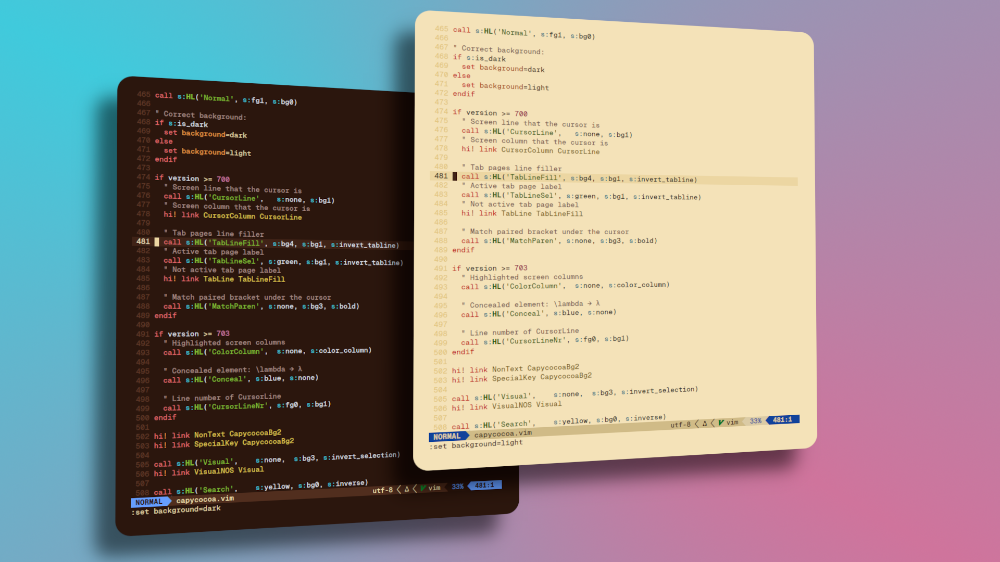
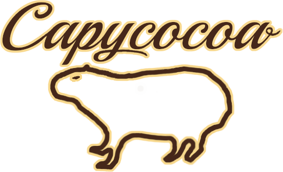
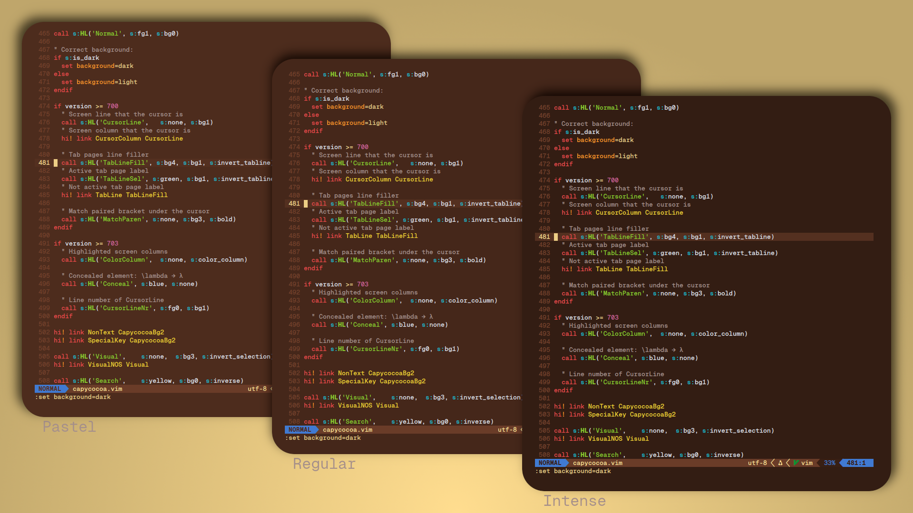
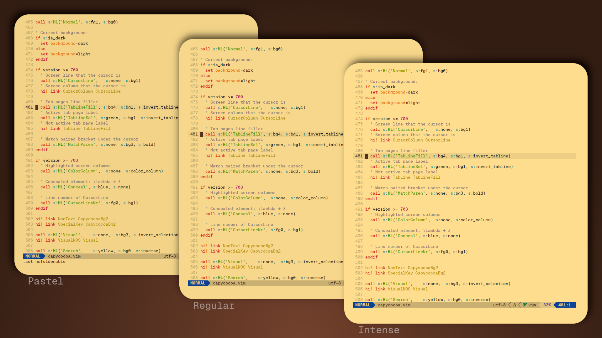
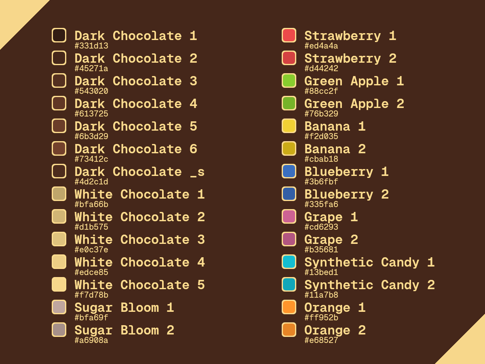
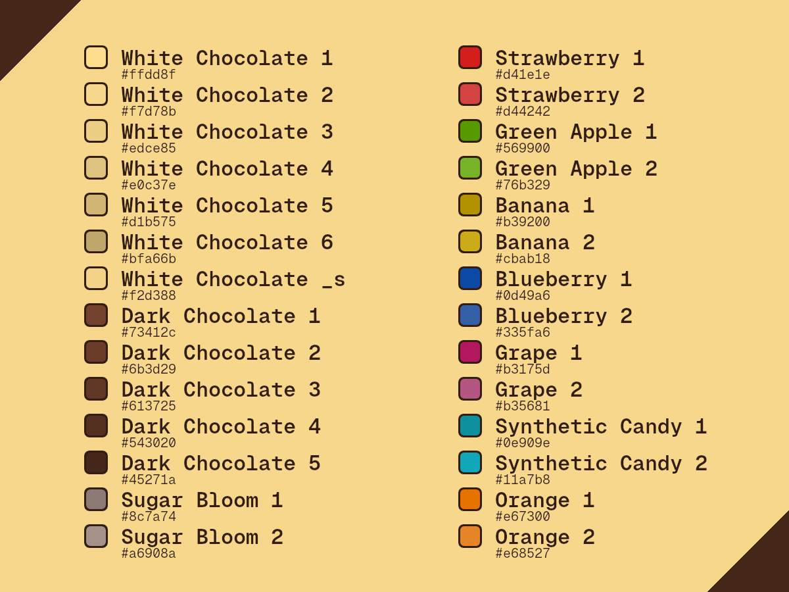

<p align="center"></p>

<p align="center"></p>

# Capycocoa
A cozy warm color scheme based on chocolate and fruit colors. And maybe the colors of capy fur. If that's even fur. Might be more like spines. :blush:

Simply copy the respective capycocoa.vim file to<br>
.config/nvim/colors/<br>
and<br>
.config/nvim/autoload/<br>
.

The default mode is dark. If you want to set light mode as standard you can define it in your .vimrc, init.lua or whatever your config file name is. :information_desk_person::laughing:<br>
For vimscript set:
```
set background=light
```
For lua set:
```
vim.opt.background="light"
```

To toggle between dark and light just execute the following commands in your running vim session.
Dark mode vim command:
```
:set background=dark
```
Light mode vim command:
```
:set background=light
```

## Modes
In order to select a specific mode (regular, intense or pastel) add the following command to your .vimrc or init.lua.
vimscript:
```
let g:capycocoa_contrast_dark='intense'
```
lua:
```
vim.api.nvim_set_var('capycocoa_contrast_dark', 'intense')
```
### Dark
<p align="center"></p>

### Light
<p align="center"></p>

## Palette
### Dark
<p align="center"></p>

### Light
<p align="center"></p>

## Credit
The code of the .vim files is forked from Gruvbox [MIT/X11][]. :neckbeard:

## License
[MIT/X11][]

   [MIT/X11]: https://en.wikipedia.org/wiki/MIT_License
