<ul>
   <li>v1.1:
      <ul>
         <li>updated bg colors - slightly darker and lighter shades for the respective modes</li>
         <li>updated syntax colors for higher legibility - most of the syntax colors now meet the contrast ratio of 4.5:1 🔬 ☺️</li>
      </ul>
   </li>
</ul>
<br>
<br>

<p align="center">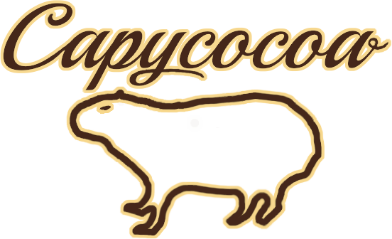</p>

<p align="center">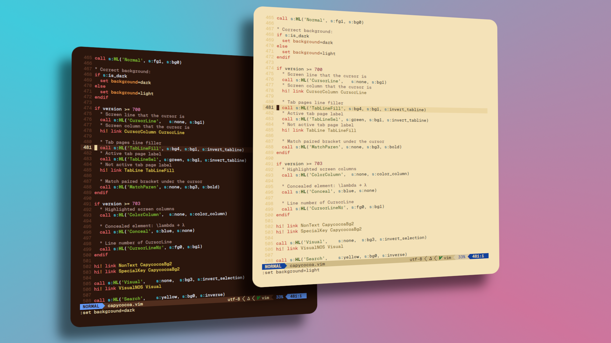</p>

# Capycocoa
A cozy warm color scheme based on chocolate and fruit colors. And maybe the colors of capy fur. If that's even fur. Might be more like spines. :blush:

## Install
Simply copy the respective capycocoa.vim file to<br>
.config/nvim/colors/<br>
and<br>
.config/nvim/autoload/<br>
.

## Dark/Light
The default mode is dark. If you want to set light mode as standard you can define it in your .vimrc, init.lua or whatever your config file name is. :information_desk_person::laughing:<br>
For vimscript set:
```
set background=light
```
For lua set:
```
vim.opt.background="light"
```

To toggle between dark and light just execute the following commands in your running vim session.
Dark mode vim command:
```
:set background=dark
```
Light mode vim command:
```
:set background=light
```

## Modes
In order to select a specific mode (regular, intense or pastel) add the following command to your .vimrc or init.lua.<br>
vimscript:
```
let g:capycocoa_contrast_dark='intense'
```
lua:
```
vim.api.nvim_set_var('capycocoa_contrast_dark', 'intense')
```
### Dark
<p align="center">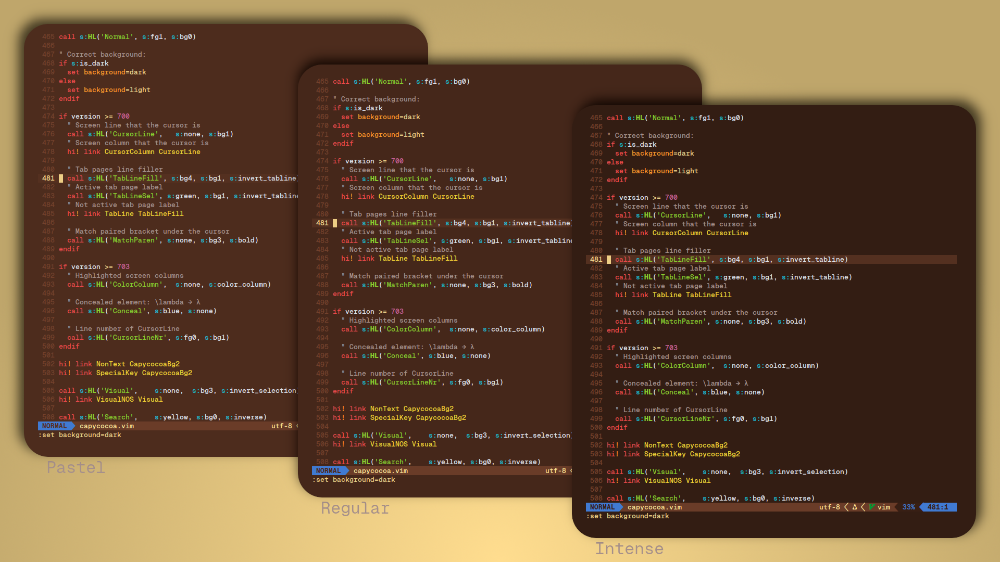</p>

### Light
<p align="center">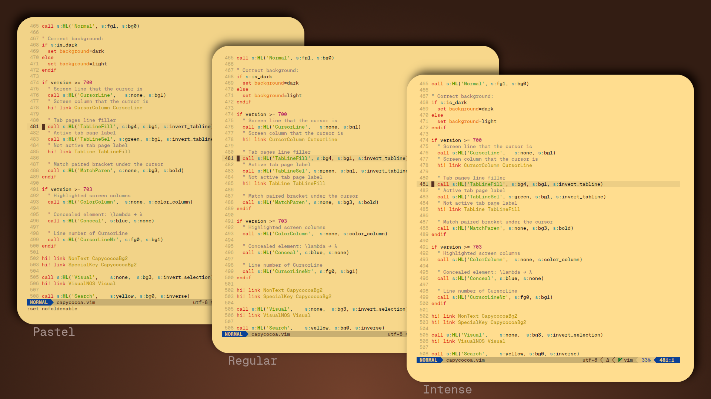</p>

## Palette
<p>The following is an excerpt from the "capycocoa.vim colors file" showing the currently used color codes. It comprises the hex, ansi256 and rgb color codes.</p>
<p align="center">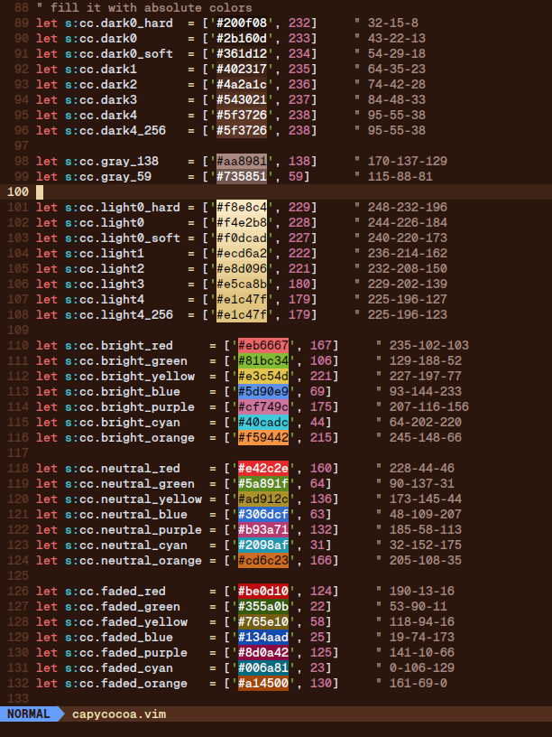</p>

## Palette Test
<p>Experimenting with HSLuv. I'm going to take a look at these test pictures on a couple of different monitors in order to see which grading feels more natural to me. The current theme is based on HSL grading but I might switch it in the future.</p>

### dark
#### HSLuv
<p align="center">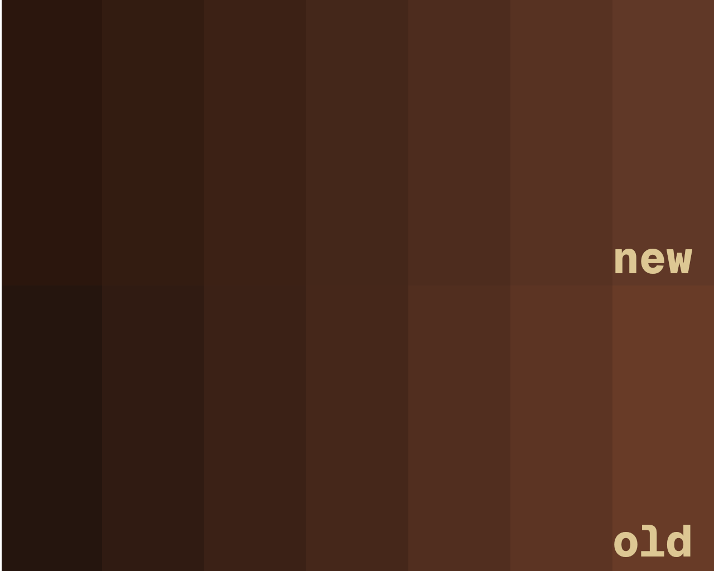</p>

#### HSLuv with HSL interpolation
<p align="center">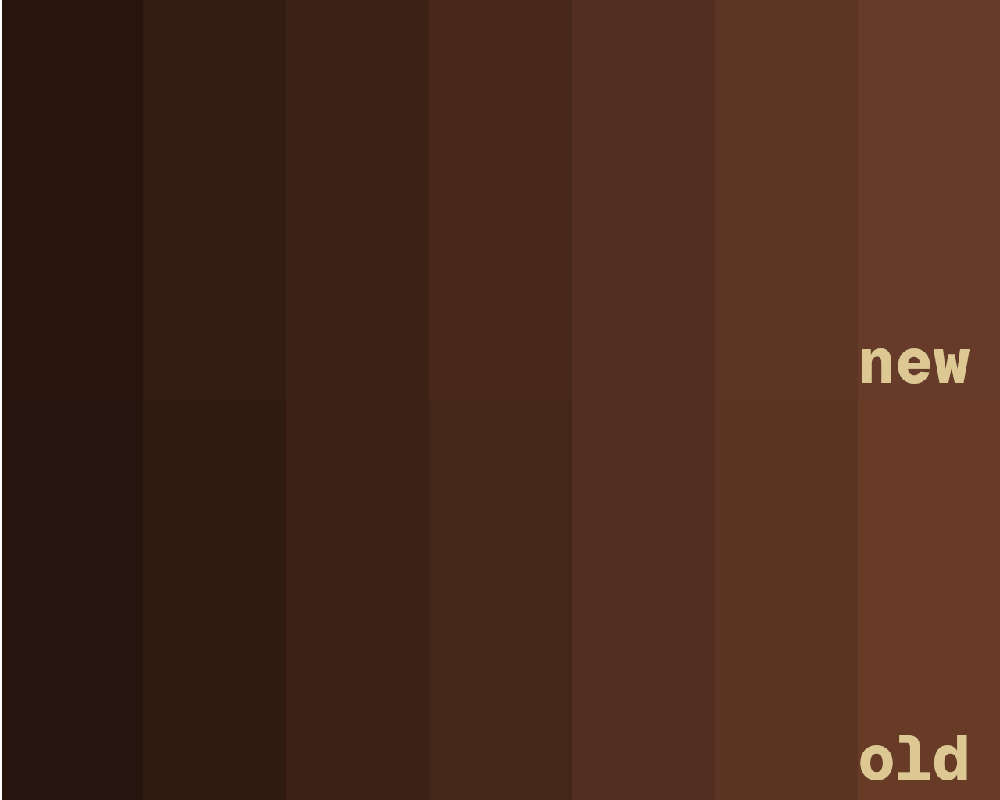</p>

#### HSLuv with HSL interpolation darker
<p align="center">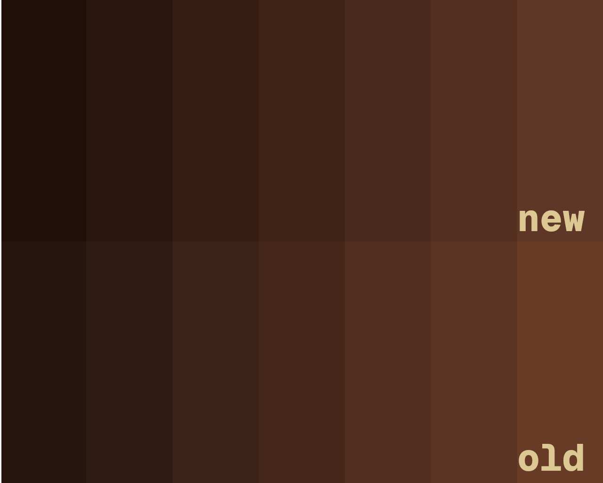</p>

### light
#### HSLuv
<p align="center">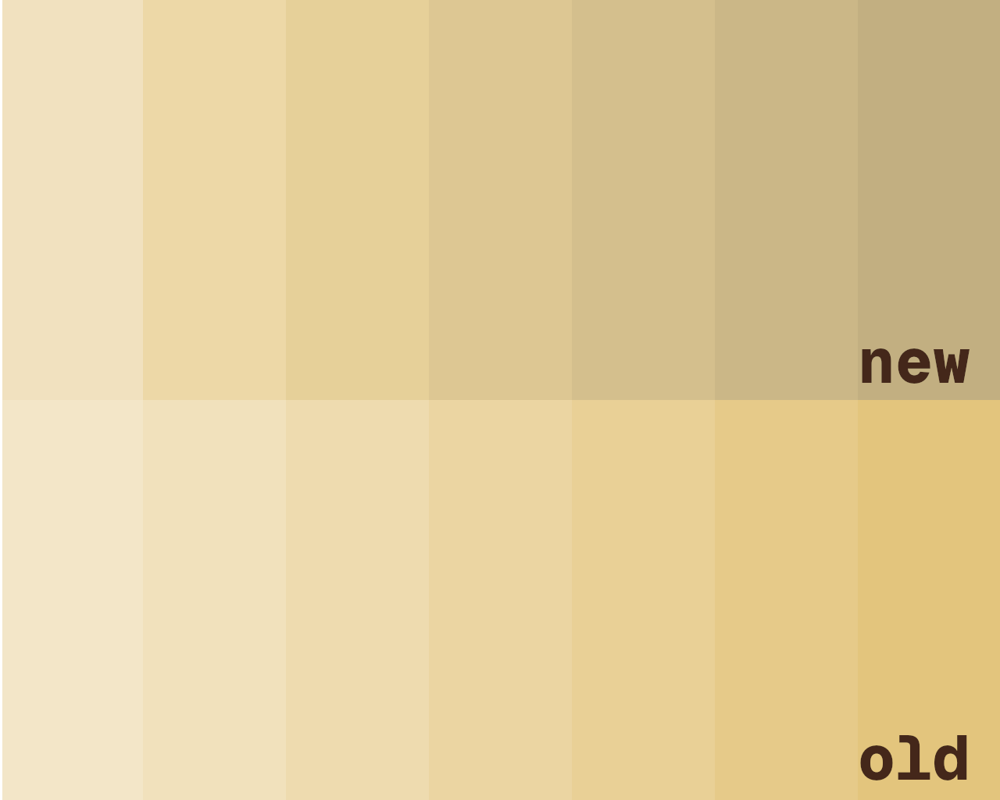</p>

#### HSL with subtle contrast grading
<p align="center">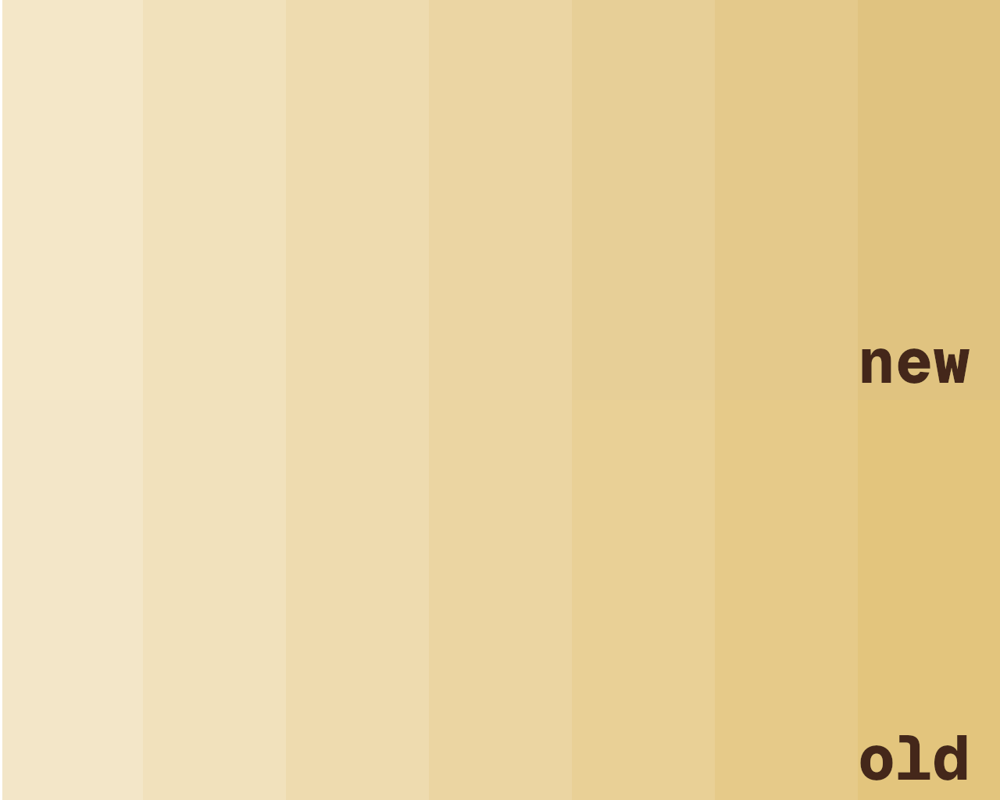</p>

#### HSL with contrast grading
<p align="center">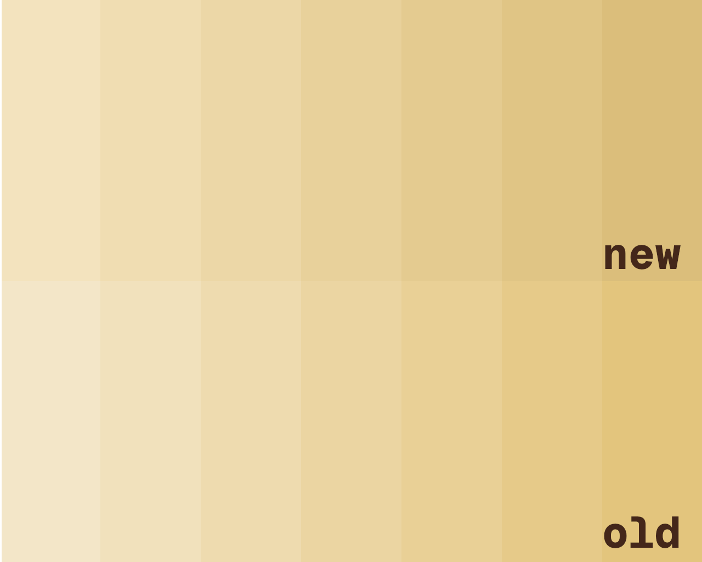</p>

## Credit
The code of the .vim files is forked from Gruvbox [MIT/X11][]. :neckbeard:

## License
[MIT/X11][]

   [MIT/X11]: https://en.wikipedia.org/wiki/MIT_License
