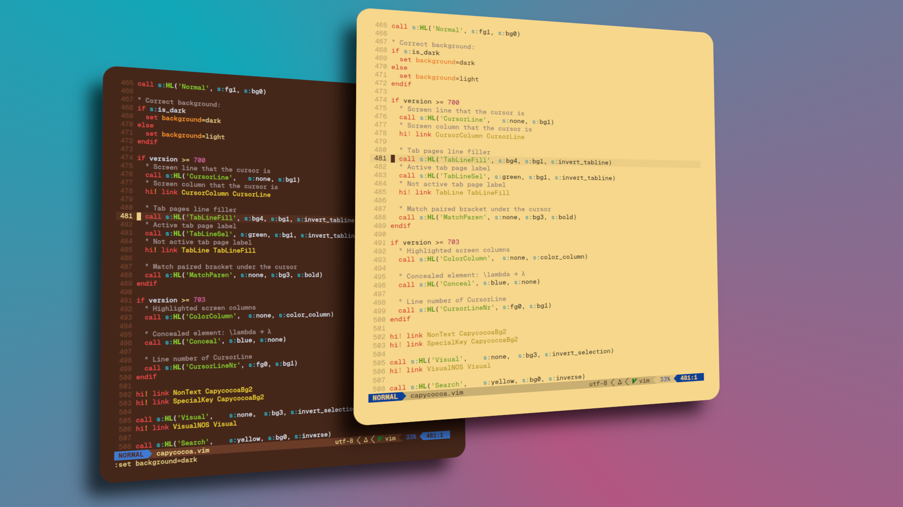
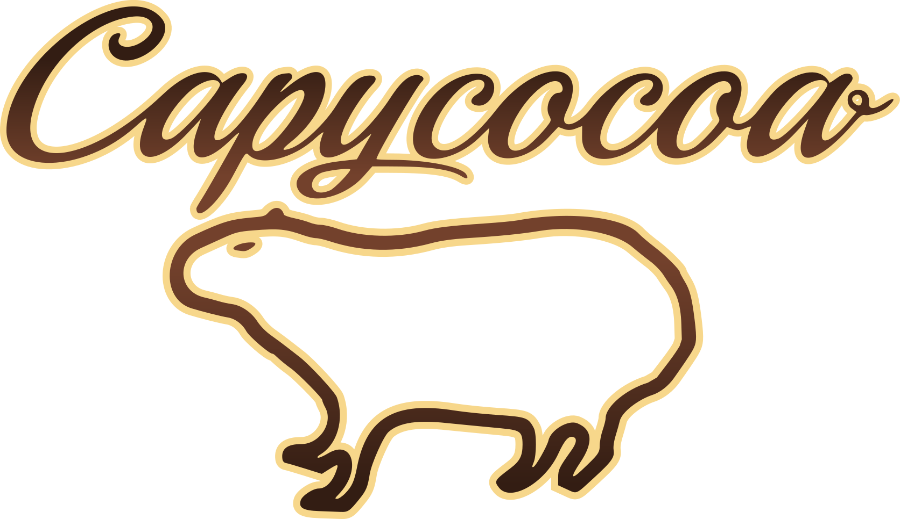

<p align="center"></p>

<p align="center"></p>

# Capycocoa
A cozy warm color scheme based on chocolate and fruit colors.

Simply copy the respective capycocoa.vim file to<br>
.config/nvim/colors/<br>
and<br>
.config/nvim/autoload/<br>
.

Dark mode (set to standard) vim command:
```
:set background=dark
```
Light mode vim command:
```
:set background=light
```

# Palette
### Dark
<p align="center"></p>

### Light
<p align="center"></p>

# Credit
The code of the .vim files is forked from Gruvbox [MIT/X11][].

# License
[MIT/X11][]

   [MIT/X11]: https://en.wikipedia.org/wiki/MIT_License
